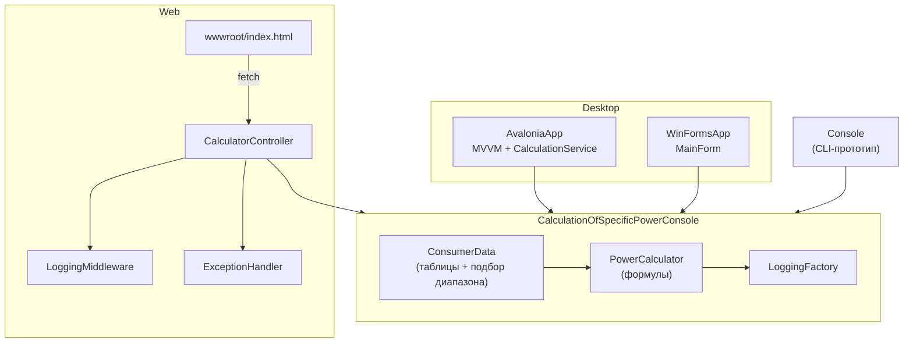

# Расчёт удельных мощностей

**Коммерческое desktop-приложение для Чувашгражданпроект** (Чебоксары) — проектной организации, занимающейся низковольтными распределительными сетями.

Инженеры выполняли **десятки расчётов удельной мощности ежедневно** вручную в Excel: искали нужную строку в больших нормативных таблицах, копировали значения и последовательно считали мощность, ток, момент и потери. Одна пропущенная строка или неверно скопированная ячейка могли испортить результат.

Приложение **автоматизирует этот процесс**: подбор диапазона из таблицы, линейная интерполяция и производные электротехнические расчёты выполняются в одном месте, на тех же нормативных данных, которыми команда уже пользовалась. Это узкий инструмент, а не платформа — но он заменил повторяющуюся ручную работу детерминированным desktop-workflow.

В репозитории несколько интерфейсов (desktop и web) поверх общего вычислительного ядра. Исходная **WinForms-версия была передана в эксплуатацию**; **Avalonia UI** — последующий редизайн с сохранением той же логики.

---

## Проблема и результат

| Было | Стало |
|------|-------|
| Ручной поиск в Excel-таблицах для каждого количества и типа потребителей | Автоматический подбор min/max из встроенных справочных данных |
| Несколько разрозненных шагов (мощность → ток → момент → потери) | Одно приложение, последовательные расчёты без переключения файлов |
| Риск ошибок невнимательности при работе с большими таблицами | Одинаковые формулы каждый раз; предсказуемое округление |
| Нужен переносной `.exe` для рабочих мест без установленного .NET | Путь к self-contained publish для WinForms (см. [Разработка](#разработка)) |

Область применения намеренно узкая: **один домен, одна организация, одна задача** — ускорить и обезопасить рутинные расчёты удельной мощности в проектной работе.

---

## Основные возможности

- **Реальный production-кейс** — разработано и используется в проектном бюро; автоматизирует ежедневные расчёты для Чувашгражданпроект
- **Справочный подбор потребителей** — 14 опорных точек (5–1000 потребителей) для четырёх типов
- **Линейная интерполяция** — удельная мощность (кВт на единицу) между границами таблицы
- **Производные расчёты** — расчётная мощность, фазный ток (cos φ), момент ЛЭП, потери в кабеле
- **Несколько интерфейсов** — Avalonia desktop (актуальный), WinForms (legacy), ASP.NET Core API + статический web UI, консольный прототип
- **Интерактивная 3D-визуализация** (Avalonia) — поле мощности реагирует на результаты расчёта
- **Валидация ввода** — парсинг с учётом локали и понятные состояния ошибок в desktop-приложениях
- **Структурированное логирование** — `Microsoft.Extensions.Logging` в ядре и web-хосте

---

## Технологический стек

| Слой | Технология | Назначение |
|------|------------|------------|
| Runtime | .NET 8 | Все проекты на `net8.0` |
| Вычислительное ядро | `CalculationOfSpecificPowerConsole` | Формулы, справочные таблицы, логирование |
| Desktop (актуальный) | Avalonia UI 12, CommunityToolkit.Mvvm | MVVM, glass UI, 3D-сцена |
| Desktop (legacy) | Windows Forms | Исходный production UI (`net8.0-windows`) |
| Web | ASP.NET Core + MVC controllers | REST API и статический frontend в `wwwroot` |
| Тестирование | xUnit 2.5 | Unit-тесты интерполяции и подбора таблицы |
| Логирование | `Microsoft.Extensions.Logging` (Console, Debug) | Трассировка расчётов и HTTP-запросов |

В репозитории **нет базы данных**, **аутентификации** и **конфигурации Docker/CI**.

---

## Архитектура

Решение построено по схеме **общее ядро + тонкие слои представления**. Вся бизнес-логика — в `CalculationOfSpecificPowerConsole`; UI-проекты отвечают только за ввод, валидацию, форматирование и отображение.



### Поток расчёта

1. Пользователь вводит **количество потребителей** и **тип потребителя** (строковый идентификатор на русском).
2. `ConsumerData.GetDataList` находит диапазон таблицы и возвращает  
   `[count, flatMin, flatMax, kW_min, kW_max]`.
3. `PowerCalculator.CalculateSpecificPower` выполняет линейную интерполяцию:

   ```
   P_уд = kW_max − (kW_max − kW_min) / (flatMax − flatMin) × (count − flatMin)
   ```

4. Производные величины:
   - **Расчётная мощность** — `P_р = P_уд × count`
   - **Ток** — `I = P_р / (0.38 × cos φ × √3)`
   - **Момент** — `M = длина × P_р`
   - **Потери** (desktop) — `(P × длина) / (C × S)`, где `C = 44` (алюминий) или `72` (медь)

Справочные данные и формулы:

- `CalculationOfSpecificPowerConsole/Common/ConsumerData.cs`
- `CalculationOfSpecificPowerConsole/Common/PowerCalculator.cs`

### Слои Avalonia-приложения

Avalonia добавляет presentation-слой без изменения формул:

```
MainWindow (View)
    → MainViewModel (CommunityToolkit.Mvvm)
        → CalculationService (оркестрация, 1:1 с WinForms)
            → PowerCalculator / ConsumerData
        → InputParser (парсинг локали, формат округления)
    → PowerFieldView (только визуализация)
```

Кастомные контролы (`GlassCard`, `GlassField`, `AmbientBackground`) и стили — в `Controls/` и `Styles/`.

---

## Структура проекта

```text
CalculationOfSpecificPower/
├── CalculationOfSpecificPowerConsole/      # Общее вычислительное ядро
│   ├── Common/
│   │   ├── ConsumerData.cs                 # Табличные kW по типам потребителей
│   │   ├── PowerCalculator.cs              # Интерполяция и формулы
│   │   └── LoggingFactory.cs
│   └── Program.cs                          # CLI-прототип
│
├── CalculationOfSpecificPower.AvaloniaApp/ # Актуальный desktop UI (Avalonia 12 + MVVM)
│   ├── ViewModels/
│   ├── Views/
│   ├── Services/                           # CalculationService, InputParser
│   ├── Controls/                           # Glass design-system
│   ├── Visualization/                      # 3D power-field
│   └── Styles/
│
├── CalculationOfSpecificPowerWinFormsApp/  # Legacy WinForms UI
│   ├── MainForm.cs                         # Эталонное поведение
│   └── MainForm.Designer.cs
│
├── CalculationOfSpecificPowerWebApp/       # ASP.NET Core host
│   ├── Controllers/CalculatorController.cs
│   ├── Middleware/LoggingMiddleware.cs
│   ├── Infrastructure/ExceptionHandler.cs
│   └── wwwroot/index.html
│
└── CalculationOfSpecificPower.Tests/       # xUnit-тесты ядра
    └── Common/
        ├── PowerCalculatorTest.cs
        └── ConsumerDataTest.cs
```

---

## Быстрый старт

### Требования

- [.NET 8 SDK](https://dotnet.microsoft.com/download/dotnet/8.0)
- **Windows** — для WinForms (`net8.0-windows`)
- Стандартная конфигурация GPU/драйверов для Avalonia Skia (Windows / macOS / Linux)

### Клонирование и сборка

```bash
git clone <repository-url>
cd CalculationOfSpecificPower
dotnet build CalculationOfSpecificPower.sln
```

### Запуск приложений

**Avalonia desktop (рекомендуется):**

```bash
dotnet run --project CalculationOfSpecificPower.AvaloniaApp
```

**WinForms desktop (legacy):**

```bash
dotnet run --project CalculationOfSpecificPowerWinFormsApp
```

**Web API + статический UI:**

```bash
dotnet run --project CalculationOfSpecificPowerWebApp
```

HTTP по умолчанию: `http://localhost:5183` (см. `CalculationOfSpecificPowerWebApp/Properties/launchSettings.json`).

**Консольный прототип:**

```bash
dotnet run --project CalculationOfSpecificPowerConsole
```

Читает значения из stdin — удобно для проверки ядра без GUI.

### Переменные окружения

Файл `.env` не требуется. Web-приложение использует стандартную конфигурацию ASP.NET Core:

| Переменная | По умолчанию | Назначение |
|------------|--------------|------------|
| `ASPNETCORE_ENVIRONMENT` | `Development` в launch profiles | Окружение ASP.NET Core |
| `ASPNETCORE_URLS` | задаётся в `launchSettings.json` | HTTP/HTTPS binding |

---

## Разработка

```bash
# Сборка всего solution
dotnet build CalculationOfSpecificPower.sln

# Сборка одного проекта
dotnet build CalculationOfSpecificPower.AvaloniaApp/CalculationOfSpecificPower.AvaloniaApp.csproj

# Тесты
dotnet test CalculationOfSpecificPower.Tests/CalculationOfSpecificPowerConsole.Tests.csproj

# Avalonia в Debug
dotnet run --project CalculationOfSpecificPower.AvaloniaApp

# Web (браузер открывается по launch profile)
dotnet run --project CalculationOfSpecificPowerWebApp
```

Отдельных скриптов lint/format/typecheck в репозитории нет. Nullable reference types включены в `.csproj`.

### WinForms single-file publish

В `CalculationOfSpecificPowerWinFormsApp.csproj` есть **закомментированные** настройки self-contained single-file (`PublishSingleFile`, `SelfContained`, `win-x64`). Они не активны; при необходимости включите вручную:

```bash
dotnet publish CalculationOfSpecificPowerWinFormsApp \
  -c Release -r win-x64 \
  --self-contained true \
  /p:PublishSingleFile=true
```

---

## Тестирование

| | |
|---|---|
| Framework | xUnit 2.5 |
| Расположение | `CalculationOfSpecificPower.Tests/` |
| Область | интерполяция `PowerCalculator`, подбор диапазона `ConsumerData.GetDataList` |
| Запуск | `dotnet test CalculationOfSpecificPower.Tests/CalculationOfSpecificPowerConsole.Tests.csproj` |

**Покрыто сейчас:**

- `CalculateSpecificPower` — корректность линейной интерполяции
- `CalculateFullSpecificPower` — умножение на количество потребителей
- `GetDataList` — подбор диапазона для граничных и средних значений

**Не покрыто:**

- ViewModels и UI-валидация desktop-приложений
- Web API endpoints (пакет `Microsoft.AspNetCore.Mvc.Testing` подключён, интеграционных тестов нет)
- Формулы момента, тока и потерь
- Avalonia-визуализация

---

## API

Базовый маршрут: `/api/calculator`

Все endpoints — **GET**, без аутентификации, параметры в query string.

| Endpoint | Параметры | Поле ответа |
|----------|-----------|-------------|
| `GET /api/calculator/specific-power` | `count`, `type` | `SpecificPower` |
| `GET /api/calculator/rated-power` | `count`, `type` | `FullSpecificPower` |
| `GET /api/calculator/electric-current` | `count`, `type`, `cosF` (по умолчанию `0.98`) | `ElectricCurrent` |
| `GET /api/calculator/moment` | `count`, `type`, `length` | `Moment` |

**Тип потребителя** (`type`):

- `природный газ`
- `сжиженный газ`
- `электрические плиты`
- `садовые домики`

**Пример:**

```http
GET /api/calculator/specific-power?count=55&type=электрические%20плиты
```

```json
{ "specificPower": 1.825 }
```

**Обработка ошибок:**

- Неверный тип потребителя → `400 Bad Request`, `"Неверный тип потребителя"`
- Необработанное исключение → `ExceptionHandler` возвращает HTTP 500, `{ "message": "Что-то пошло не так" }`
- Логирование запросов/ответов через `LoggingMiddleware`

Статическая страница `/` (`wwwroot/index.html`) обращается к API через JavaScript.

> **Примечание:** расчёт потерь (`CalculateLosses`) доступен в desktop-приложениях, но **не вынесен** в web API.

---

## Инженерные решения

### Под конкретный workflow заказчика

Приложение создано для замены Excel-расчётов в **Чувашгражданпроект**. Отсюда ключевые решения:

- **Нормативные таблицы в коде** — те же данные, что в Excel; не нужна новая модель
- **Desktop-first** — работа на рабочих местах инженеров; WinForms поддерживает self-contained deploy без общего .NET runtime
- **Русские идентификаторы типов потребителей** — точные строки из исходных форм (`природный газ`, `электрические плиты` и т.д.)
- **Сохранение округления при миграции UI** — Avalonia повторяет формат WinForms (3 знака, запятая в поле мощности)

Web API и Avalonia расширяют то же ядро; **WinForms остаётся эталоном поведения** для проверки паритета.

### Общее вычислительное ядро

Формулы и таблицы вынесены в `CalculationOfSpecificPowerConsole` — WinForms, Avalonia, Web и Console используют одну математику. `CalculationService` в Avalonia явно повторяет порядок вызовов и округление WinForms.

### Статические справочники вместо БД

Таблицы kW захардкожены в `ConsumerData` — как в исходном Excel-процессе. Плюс: нулевая инфраструктура. Минус: обновление таблиц требует изменения кода и redeploy.

### Avalonia MVVM с тонким service-слоем

`MainViewModel` — состояние UI, флаги валидации, команды. Вычисления — в `CalculationService`, парсинг — в `InputParser`. View не содержит бизнес-логики.

### 3D-визуализация отделена от расчётов

`PowerFieldView` отображает результаты и не влияет на вычислительный движок.

### Middleware web-хоста

- `LoggingMiddleware` — логирование запросов/ответов
- `ExceptionHandler` — централизованные ошибки; не пишет ответ при отмене клиентом

---

## Компромиссы

| Решение | Обоснование |
|---------|-------------|
| Статические классы `PowerCalculator` / `ConsumerData` | Простое переиспользование; достаточно для одного домена |
| WinForms сохранён рядом с Avalonia | Эталон поведения и сравнение при миграции |
| Web API — подмножество расчётов | Мощность, ток, момент; потери только в desktop |
| Console: `CalculateLossesPercent`; desktop: `CalculateLosses` | В ядре две формулы; каждый frontend вызывает свою |
| Без DI в desktop-приложениях | Малый scope; сервисы создаются напрямую во ViewModel |
| Цикл `GetDataList` без `break` | Историческая реализация; callers используют только первые 5 элементов |

---

## Безопасность

Внутренний инженерный инструмент, не hardened multi-tenant сервис.

**Реализовано:**

- Валидация ввода в desktop ViewModels
- Web API возвращает `400` для неизвестного типа потребителя
- Глобальный exception handler не отдаёт stack trace клиенту

**Не реализовано:**

- Аутентификация / авторизация
- Rate limiting
- Принудительный HTTPS (настраивается через launch profiles)
- Управление секретами (секреты не используются)

Не выставляйте web-приложение в недоверенные сети без дополнительной защиты.

---

## Развёртывание

Docker, Kubernetes и CI/CD в репозитории не настроены.

Варианты, соответствующие текущей структуре:

- **Avalonia / WinForms** — `dotnet publish` с нужным RID
- **Web** — стандартный publish ASP.NET Core (IIS, Kestrel, reverse proxy)

---

## С чего начать читать код

| Задача | Файл |
|--------|------|
| Понять математику | `CalculationOfSpecificPowerConsole/Common/PowerCalculator.cs` |
| Понять подбор из таблицы | `CalculationOfSpecificPowerConsole/Common/ConsumerData.cs` |
| Сравнить legacy UI | `CalculationOfSpecificPowerWinFormsApp/MainForm.cs` |
| Текущая desktop-архитектура | `CalculationOfSpecificPower.AvaloniaApp/ViewModels/MainViewModel.cs` |
| API | `CalculationOfSpecificPowerWebApp/Controllers/CalculatorController.cs` |
| Регрессионные проверки | `CalculationOfSpecificPower.Tests/Common/` |

---

## Участие в разработке

1. Fork и clone репозитория
2. Feature branch
3. Изменения расчётов — в `CalculationOfSpecificPowerConsole`, если только UI — в соответствующем проекте
4. При изменении интерполяции или таблиц — обновить xUnit-тесты
5. Проверка: `dotnet build CalculationOfSpecificPower.sln && dotnet test`
6. Pull request с описанием влияния на поведение

При изменении формул сверяйте результаты с WinForms-эталоном или существующими тестами.

---

## Лицензия

Файл лицензии в репозитории отсутствует. Свяжитесь с maintainer перед распространением.
